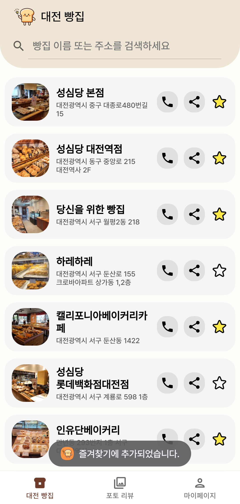
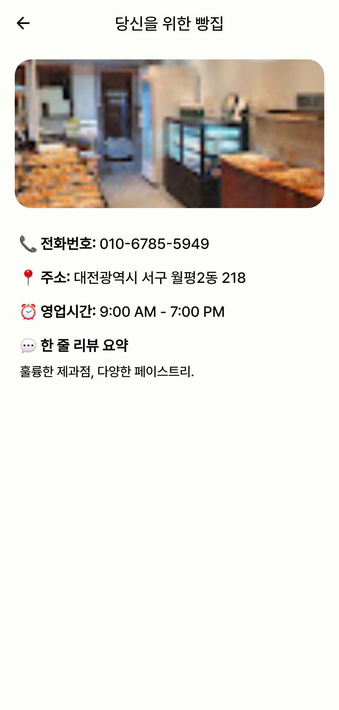
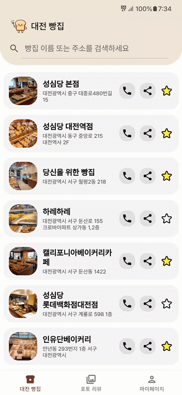
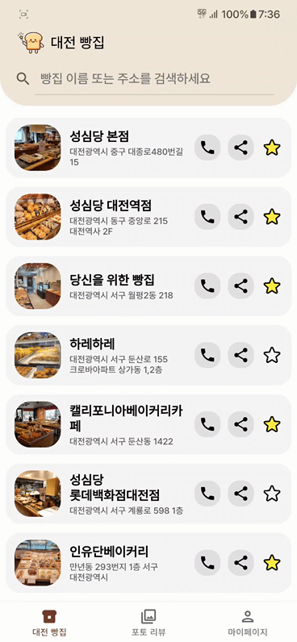
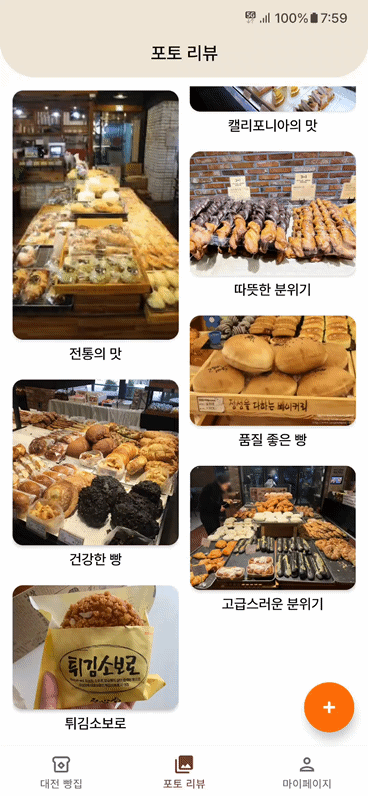
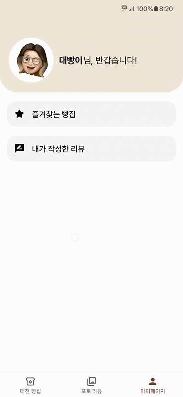

## 니빵내빵

### Outline

니빵내빵은 빵집 정보를 검색하고 리뷰를 작성할 수 있는 앱입니다.

### Team

- 신진영
    - https://github.com/Jjinyshin
- 안세혁
    - https://github.com/shyukahn

### Tech Stack

**Front-end** : Kotlin

**IDE** : Android Studio

## Details

### 스플래시 & 로그인 화면

    

- 앱을 처음 실행하면 스플래시 화면이 표시됩니다.
- 이 앱은 사용자가 기존에 로그인한 적이 있는지 확인하여 적절한 화면으로 전환하는 기능을 제공합니다.
- 현재 아직 회원가입 기능이 구현되어있지 않기 때문에 현재에는 기기의 로컬 저장소인 Room DB에 아이디, 비밀번호, 닉네임이 저장되고 이를 통해 로그인 여부를 판단합니다.

### 메인 화면

- 메인 화면에서는 `ViewPager`를 활용하여 각 `Fragment`간의 전환을 터치 제스처로 구현하였습니다. 이를 통해 사용자는 스와이프 동작을 통해 손쉽게 다양한 화면을 탐색할 수 있습니다.
- 또한, `BottomNavigationView`와 함께 사용되어 하단 네비게이션 메뉴를 통한 화면 전환도 가능합니다. 이로써 사용자는 터치 제스처와 네비게이션 메뉴를 통해 다양한 방법으로 앱을 탐색할 수 있습니다.

### Tab1: 대전 빵집 화면
대전 지역의 빵집 정보를 제공하는 탭

    

- 각 빵집 항목마다 이미지, 빵집 이름, 주소와 함께 추가로 전화연결, 공유 즐겨찾기 추가 및 제거 버튼까지 나타냅니다.
- 빵집 데이터들을 `JSON` 형식으로 저장하고 `RecyclerView` 를 이용해 보여줍니다.
- 빵집을 즐겨찾기에 추가 및 제거하면 `Toast` 로 간단히 표시해주며 `Room` 데이터베이스를 이용해 기기에 저장합니다.
- 빵집 항목을 선택하면 연락처, 주소, 영업시간, 한 줄 리뷰 요약이 포함된 상세정보 화면을 확인할 수 있습니다.

        

- 상단의 검색창을 이용해 빵집을 이름 혹은 전화번호로 검색할 수 있습니다.
- 전화 아이콘을 누르면 전화 화면으로 바로 넘어갑니다.
- 공유 아이콘을 누르면 빵집 소개 문구와 함께 빵집 정보를 공유할 수 있습니다.

### Tab2: 포토 리뷰 화면

   

- 다른 유저가 등록했던 리뷰와 내가 추가한 리뷰의 사진과 제목을 확인할 수 있는 화면입니다.
- 리뷰를 누르면 리뷰 작성자의 프로필 사진과 닉네임, 리뷰 사진, 제목, 내용을 자세히 열람할 수 있습니다.
- 리뷰 데이터는 `Room` 데이터베이스로 기기에 저장되어 있습니다.
- 리뷰 표시는 `RecyclerView` 에서 각 리뷰를 `CardView` 로 표시하였으며 `Layout` 은  `StaggeredGridLayoutManager`로 표시했습니다.

    

- 내가 추가한 리뷰는 수정 및 삭제를 할 수 있습니다.
- 리뷰를 수정하거나 삭제하면 `Room` 데이터베이스로 바로 기기에 편집 정보가 저장되며 화면의 `RecyclerView` 에도 바로 반영이 됩니다.

### Tab3: 마이페이지 화면

        

- 마이페이지에서 나의 프로필과 닉네임, 즐겨찾는 빵집과 내가 작성한 리뷰를 확인할 수 있습니다.
- 즐겨찾는 빵집 탭에서 `Room` 데이터베이스를 통해 Tab 1에서 즐겨찾기 표시를 한 빵집이 나타납니다.
- 내가 작성한 리뷰 탭에서도 `Room` 데이터베이스를 통해 Tab 2에서 내가 추가한 리뷰가 나타납니다.
- 내가 작성한 리뷰 탭에서도 리뷰 수정 및 삭제가 가능합니다.
